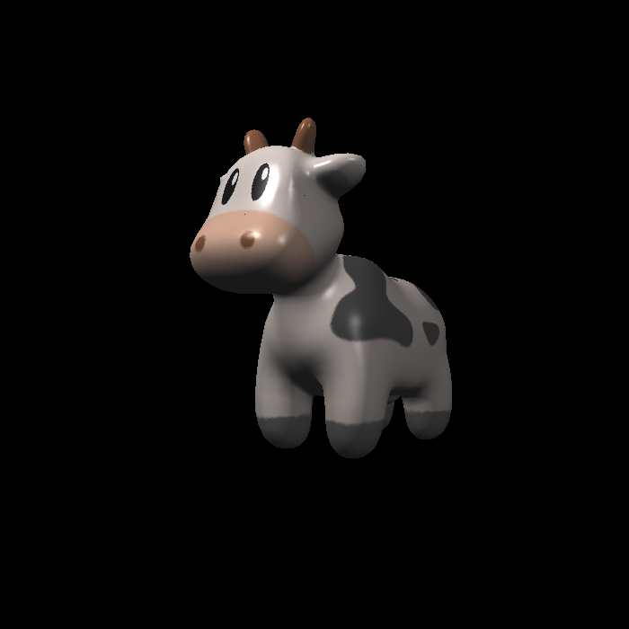

- normal.png:
  

- blinn-phong模型：
  - 求出光的方向和视角方向和衰减因子r
  - 求环境光分量，这里直接用环境光颜色ka乘以强度即可，因为环境光默认是不会衰减的
  - 求漫反射分量，根据公式求即可(kd为片段颜色)：
  $$
  L_{d} = k_{d}\left(I/r^{2}\right)max(0,\pmb{n}\cdot\pmb{l})
  $$
  - 求镜面反射分量，根据公式求即可：
  $$
  L_{s}=k_{s}\left(I/r^{2}\right)\max(0, cos\alpha)^{p}
  $$
  $$
  L_{s}=k_{s}\left(I/r^{2}\right)\max(0, \pmb{n}\cdot\pmb{h})^{p}
  $$
  - 结果:
    
- Texture Shading Fragment
Shader
  - 取纹理时要限定UV坐标,即在`Vector3f getColor(float u, float v)`函数中添加
    ```c++
    if (u < 0) u = 0;
    if (u > 1) u = 1;
    if (v < 0) v = 0;
    if (v > 1) v = 1;
    ```
  - 结果:
    
- bump
  - 结果:
    
- displacement
  - 结果:
    