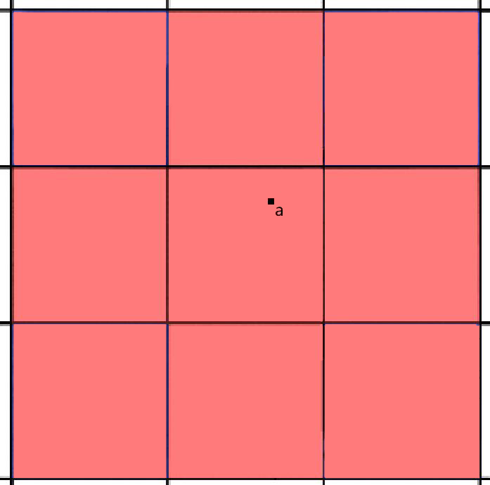

# bezier曲线
- 算法

  给定n个定点,则bezier曲线一般参数公式:
  $$
  B(t)=\sum_{i=0}^{n}{\begin{pmatrix}n\\i\\\end{pmatrix}P_{i}(1-t)^{n-i}t^{i}},t\in[0,1]
  $$
  由P0,P1推出低一级点的递推公式:
  $$
  B(t)=P_{0}+(P_{1}-p_{0})t
  $$

- 反走样

  思路: 对于一个曲线上的点，不只把它对应于一个像素，你需要根据到像素中心的距离来考虑与它相邻的像素的颜色。

  假设实际要画的点为 a(x,y), 且为float型。则实际渲染该点所在像素点及其周边的8个点。如图:
  
  计算九个像素中心距离a点的长度len, 若len小于1,a点对各像素点的影响为(1-len)*255; 若len大于1,则a点对各像素点无影响。

  对于单个像素,将所有bezier曲线上的点对其的影响加起来(最大不可超过255)则为该点的颜色值。
