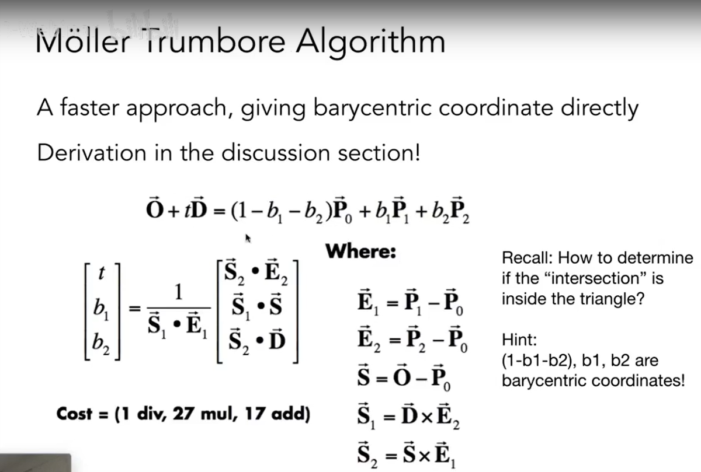

- Renderer.cpp: Render()

  [参考](https://www.scratchapixel.com/lessons/3d-basic-rendering/ray-tracing-generating-camera-rays/generating-camera-rays)

- Triangle.hpp: rayTriangleIntersect()

    根据公式:
  