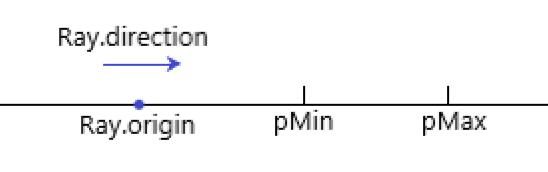
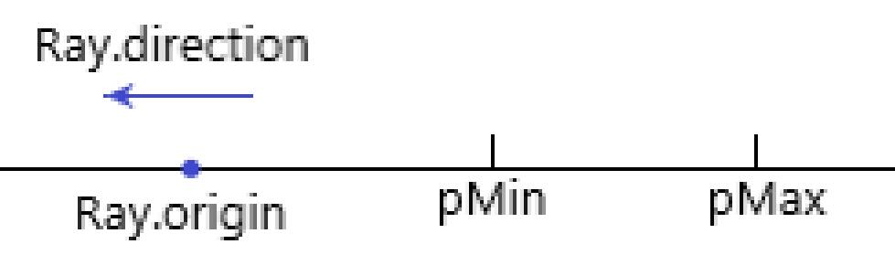
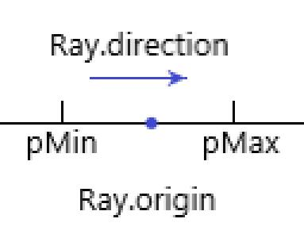
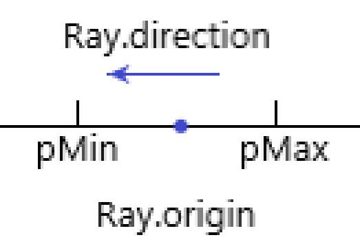
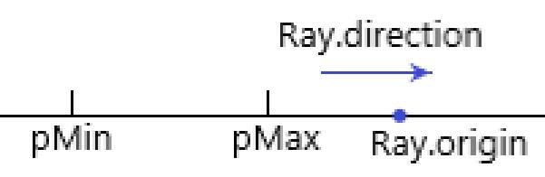
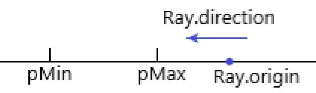
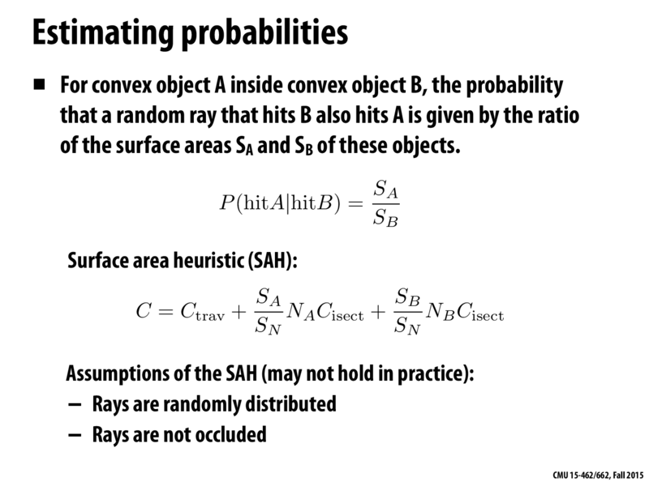

## IntersectP()
- 一维情况下:
    $$
        enter = (pMin-Ray.origin)/Ray.direction
    $$
    $$
        exit = (pMax-Ray.origin)/Ray.direction
    $$
    $$
        swap(enter,exit),(Ray.direction<0)
    $$
    - **Ray.origin < pMin < p.Max:**
      - **Ray.direction > 0**
      

          exit > enter > 0

          `return true`

      - **Ray.direction < 0**
      

          0 > enter > exit

          `return false`

    - **pMin < Ray.origin < pMax:**
      - **Ray.direction > 0**
      

          exit > 0 > enter

          `return true`

      - **Ray.direction < 0**
      

          exit > 0 > enter

          `return true`

    - **pMin < p.Max < Ray.origin:**
      - **Ray.direction > 0**
      

          0 > exit > enter

          `return false`

      - **Ray.direction < 0**
      

          exit > enter > 0

          `return true`

    综上, 相交条件为 `tEnter < tExit && tExit >= 0`

- 多维情况下

    所有维度均进box才算enter, 只要有一个维度出box即为exit, 则:
    $$
        enter = max(enters)
    $$
    $$
        exit = min(exits)
    $$

## getIntersection()

包围盒为类似二叉树的结构

先判断与包围盒(根节点)是否有交点,若无则直接跳过。若有则遍历子节点直到该节点为叶子结点，然后返回Ray与该包围盒内物体的交点。

## SAH

划分子节点时,两个子节点的分界线mid依次从头至尾遍历。得到cast最小时的mid作为子节点的划分。

## 对比

BVH生成包围盒需要1secs, Render需要14secs;

SAH生成包围盒需要23secs, Render需要12secs;

SAH与BVH相比, 的Render会变快, 但是生成包围盒的速度会变慢。不过由于包围盒每个模型只需生成一次, 而Render需要不停的执行, 所以SAH比BVH要好。

